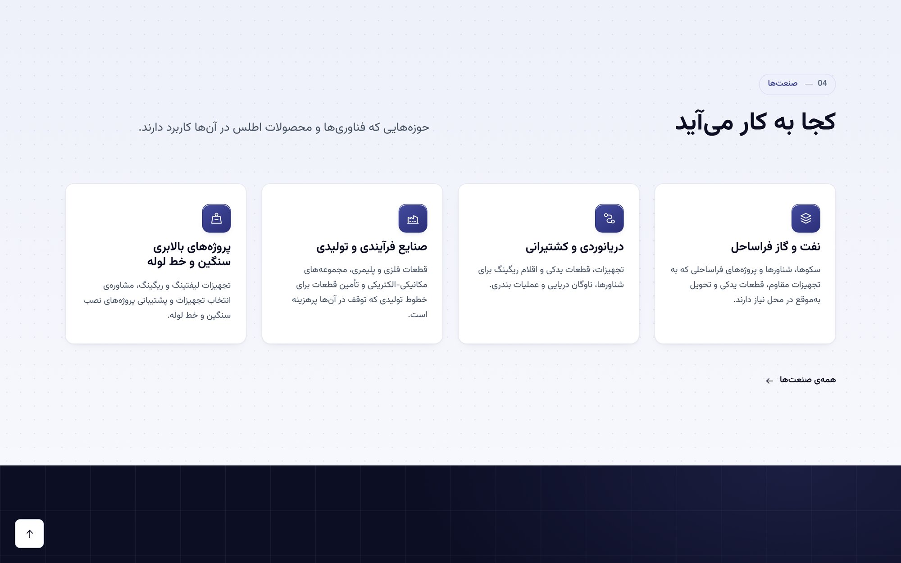
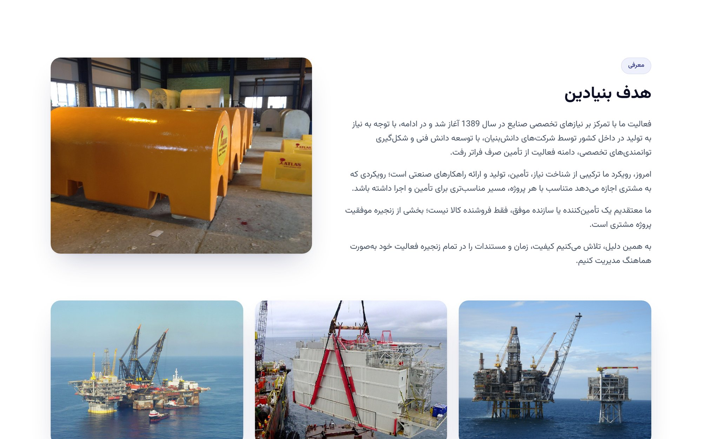

# Atlas Industrial Management — Website

Bilingual (Persian / English) corporate website for **Atlas Industrial Management** (شرکت مدیریت صنعتی اطلس) — industrial supply, manufacturing and assembly for marine, oil & gas and heavy-lift projects.

Built with Django 6.1. Persian (RTL) is the default language; English (LTR) is one click away. All content — company text, products, team, technologies, industries, FAQs — is managed from the Django admin panel.

---

## Screenshots

### Home page

<table>
  <tr>
    <td width="50%"></td>
    <td width="50%"></td>
  </tr>
  <tr>
    <td align="center"><sub>Hero — Persian (RTL)</sub></td>
    <td align="center"><sub>Hero — English (LTR)</sub></td>
  </tr>
  <tr>
    <td></td>
    <td></td>
  </tr>
  <tr>
    <td align="center"><sub>Industries</sub></td>
    <td align="center"><sub>Why Atlas — core values</sub></td>
  </tr>
</table>

### Products

<table>
  <tr>
    <td width="50%"></td>
    <td width="50%"></td>
  </tr>
  <tr>
    <td align="center"><sub>Catalogue with filters — Persian</sub></td>
    <td align="center"><sub>Product detail — English</sub></td>
  </tr>
</table>

### Company, quality and contact

<table>
  <tr>
    <td width="50%"></td>
    <td width="50%"></td>
  </tr>
  <tr>
    <td align="center"><sub>About the company</sub></td>
    <td align="center"><sub>Engineering &amp; quality process</sub></td>
  </tr>
  <tr>
    <td colspan="2"></td>
  </tr>
  <tr>
    <td colspan="2" align="center"><sub>Contact</sub></td>
  </tr>
</table>

### Mobile

<table>
  <tr>
    <td align="center"></td>
    <td align="center"></td>
    <td align="center"></td>
  </tr>
  <tr>
    <td align="center"><sub>Home — Persian</sub></td>
    <td align="center"><sub>Home — English</sub></td>
    <td align="center"><sub>Products — Persian</sub></td>
  </tr>
</table>

---

## Features

- **Bilingual** — Persian (default, RTL) and English (LTR). Interface strings use Django i18n (`locale/`), database content uses `django-modeltranslation`.
- **Admin-managed content** — company info, products (with gallery, specs, features, applications, documents), product lines, team members, technologies, industries, statistics, FAQs and news. Optional fields can be left empty without breaking any page.
- **Product catalogue** — filter by product line, technology and industry, plus search.
- **SEO** — per-page meta, `hreflang`, Open Graph, JSON-LD structured data, sitemap and `robots.txt`.
- **Image optimisation** — uploads are resized and compressed automatically.
- **Responsive** — tested on phone, tablet and desktop in both languages.

## Tech stack

- Python 3.12+, Django 6.1
- PostgreSQL (`psycopg2-binary`)
- `django-modeltranslation`, Pillow, `python-dotenv`, `qrcode`
- Plain CSS and vanilla JavaScript — no frontend build step

## Getting started

```bash
# 1. Create and activate a virtual environment
python -m venv .venv
.venv\Scripts\activate          # Windows
# source .venv/bin/activate     # macOS / Linux

# 2. Install dependencies
pip install -r requirements.txt

# 3. Configure environment variables
copy .env.example .env          # Windows  (cp on macOS / Linux)
#    then edit .env: SECRET_KEY, DB_* settings, ALLOWED_HOSTS, ...

# 4. Create the database schema and an admin user
python manage.py migrate
python manage.py createsuperuser

# 5. Load the company's content (text, logo, About photos) — safe to re-run
python manage.py load_client_content

# 6. Run the development server
python manage.py runserver
```

Then open <http://127.0.0.1:8000/> (site) and <http://127.0.0.1:8000/admin/> (admin panel).

> `media/` (uploaded files) is not tracked in git. `load_client_content` copies the logo and the About photo into it from `static/`.

## Managing content

Everything visible on the site is edited from the admin panel:

| What | Where in admin |
|---|---|
| Company name, texts, logo, images, contact details | اطلاعات شرکت |
| Products (photo, gallery, specs, documents) and product lines | محصولات / خطوط محصول |
| Team members (photo, role, bio, links) | اعضای تیم |
| Technologies, industries, values, capabilities, statistics, FAQs | حوزه‌های فناوری / صنعت‌ها / تمایزها / توانمندی‌ها / آمار / پرسش‌های پرتکرار |

Each translatable field has a Persian and an English version. Records can be hidden without deleting them via **نمایش در سایت** (show on site).

## Tests

```bash
python manage.py test
```

## License

[MIT](LICENSE)
