<div align="center">

# Atlas Industrial Management — Corporate Website

**A bilingual (Persian / English) corporate website for an industrial supply, manufacturing and offshore-services company.**

Django · PostgreSQL · Persian RTL + English LTR · Fully admin-managed content

<a href="https://github.com/amir-ekhtiyari"></a>

*Designed & developed by **Amir Ekhtiyari***

</div>

<p align="center">
  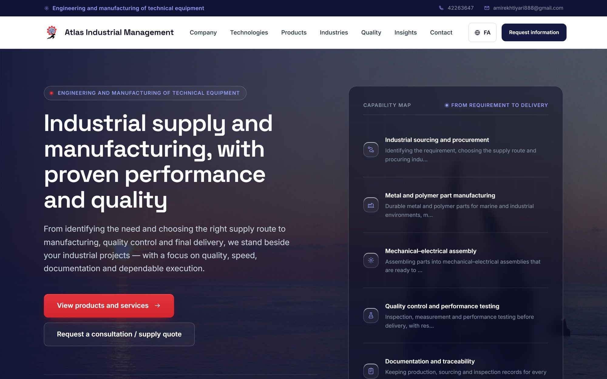
</p>

---

## About the project

Atlas Industrial Management (شرکت مدیریت صنعتی اطلس) supplies and manufactures equipment for the marine, oil & gas and heavy-lift industries — lifting and rigging gear, buoyancy modules, spare parts — and provides shipping, customs and offshore project-management services.

The brief was a site that feels as dependable as the company: clear, fast, credible in front of engineers and procurement teams, and equally polished in Persian and English. Everything a visitor sees — texts, photos, products, certificates, client logos — is managed by the client from the admin panel.

## Highlights

- **True bilingual site** — Persian (default, right-to-left) and English (left-to-right) with a one-click switch; every layout, icon and animation is mirrored correctly.
- **Product catalogue** — product lines, filters by line / technology / industry, search, photo galleries, technical specification tables and downloadable PDF catalogues.
- **Brand-driven design system** — navy, blue and red taken from the client’s logo; layered card shadows, consistent icon style, smooth scroll reveals and hover motion (with a reduced-motion fallback).
- **Credibility sections** — trust bar with company figures, ISO certificates, letters of satisfaction (open full-size in a built-in image viewer) and an animated client-logo strip.
- **Admin-first** — new admin sections for clients, letters, gallery and service photos; optional fields can be left empty without breaking any page.
- **SEO & performance** — `hreflang`, Open Graph, JSON-LD structured data, sitemap, automatic image optimisation, cache-busted static assets.
- **Tested** — 90 automated tests, including real admin-form flows and a full content-loader run in both languages.

---

## Screenshots

### Home page

<table>
  <tr>
    <td width="50%">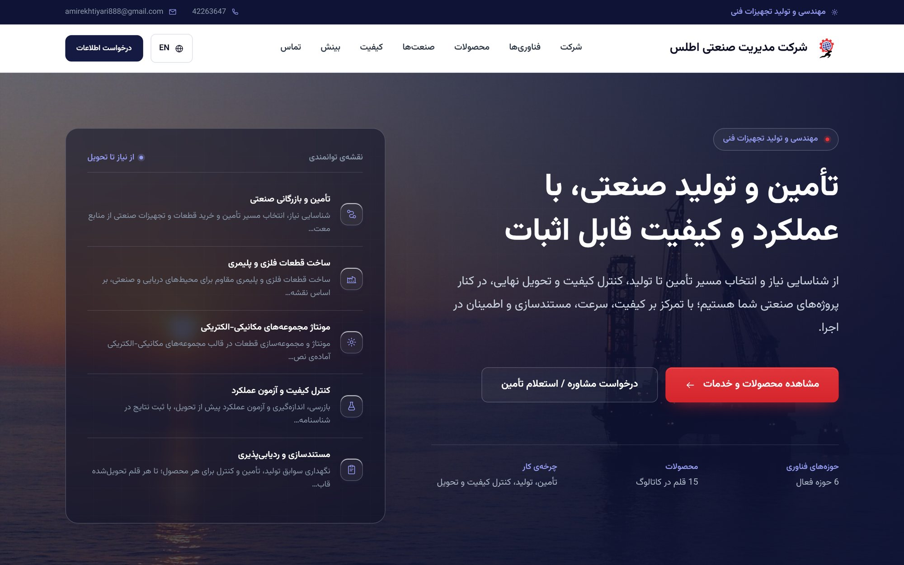</td>
    <td width="50%">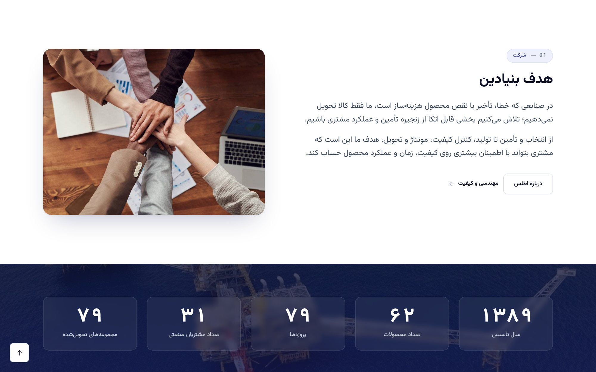</td>
  </tr>
  <tr>
    <td align="center"><sub>Hero — Persian (RTL)</sub></td>
    <td align="center"><sub>Our purpose &amp; trust bar</sub></td>
  </tr>
  <tr>
    <td>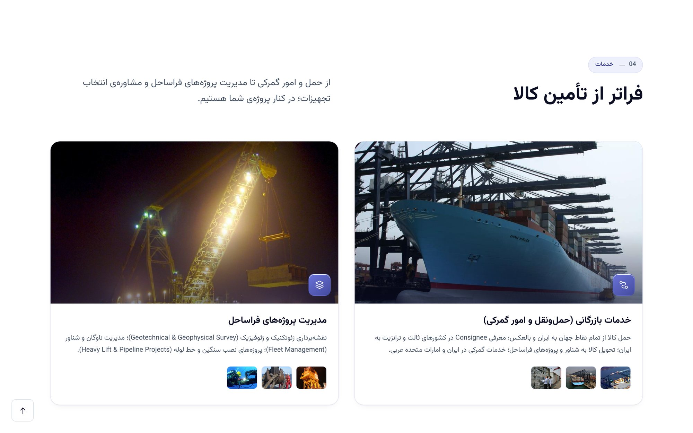</td>
    <td>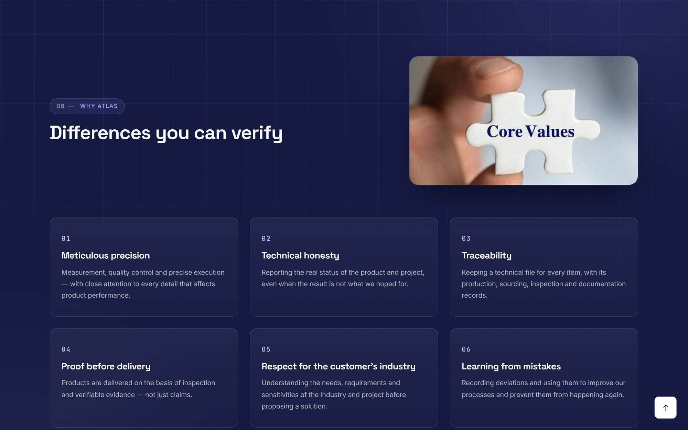</td>
  </tr>
  <tr>
    <td align="center"><sub>Services with photo galleries</sub></td>
    <td align="center"><sub>Core values</sub></td>
  </tr>
  <tr>
    <td colspan="2">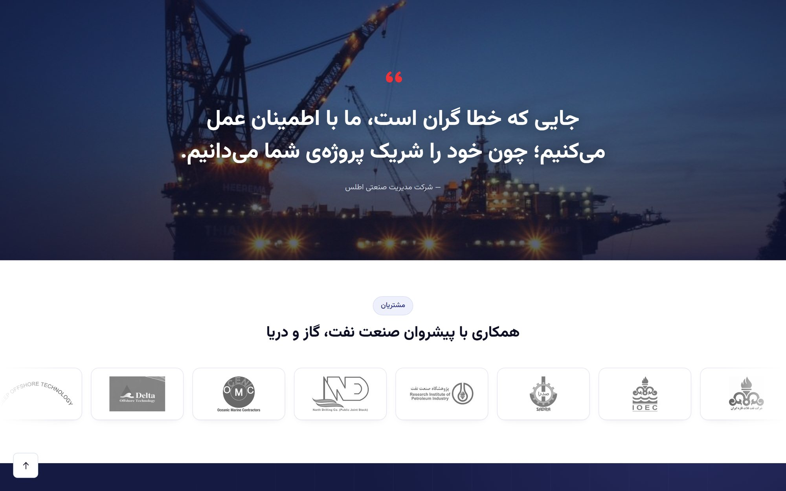</td>
  </tr>
  <tr>
    <td colspan="2" align="center"><sub>Brand slogan &amp; client logo strip</sub></td>
  </tr>
</table>

### Products

<table>
  <tr>
    <td width="50%">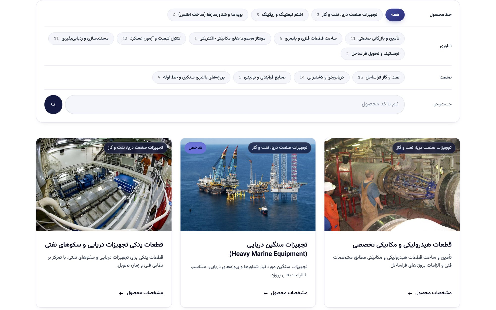</td>
    <td width="50%">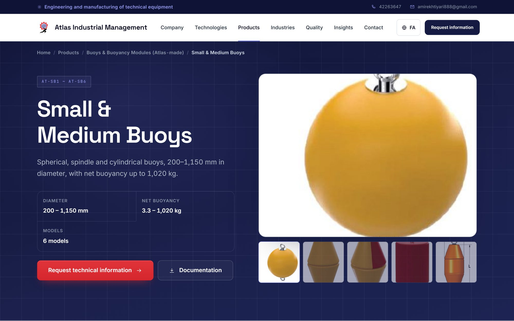</td>
  </tr>
  <tr>
    <td align="center"><sub>Catalogue with filters — Persian</sub></td>
    <td align="center"><sub>Product page with gallery &amp; specs — English</sub></td>
  </tr>
</table>

### Company, quality and contact

<table>
  <tr>
    <td width="50%">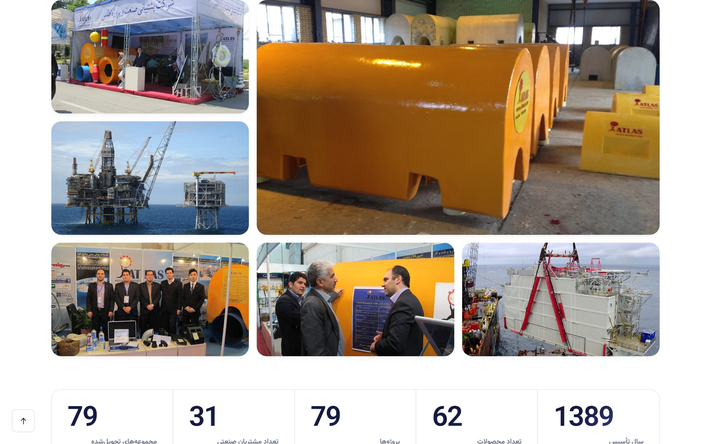</td>
    <td width="50%">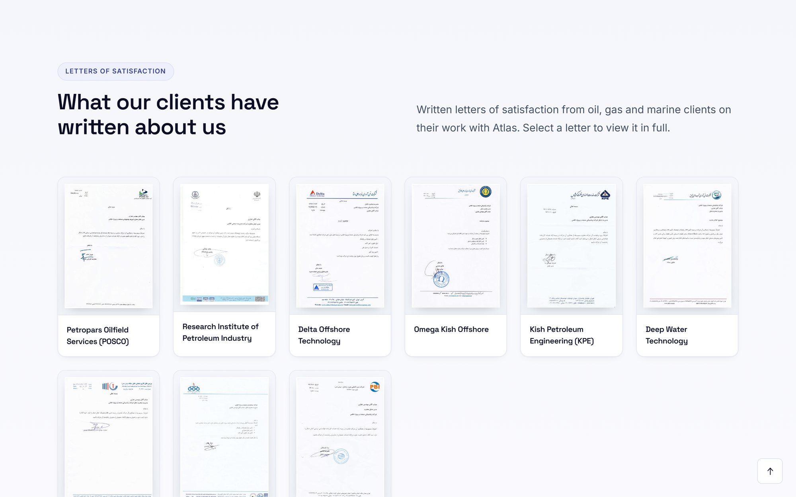</td>
  </tr>
  <tr>
    <td align="center"><sub>Company photo gallery</sub></td>
    <td align="center"><sub>Letters of satisfaction</sub></td>
  </tr>
  <tr>
    <td>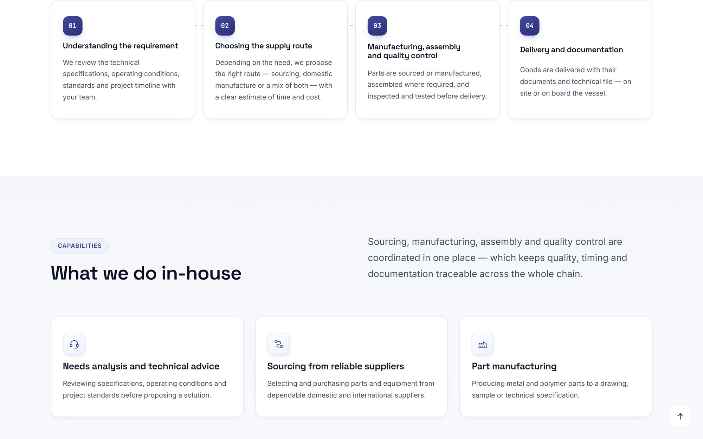</td>
    <td>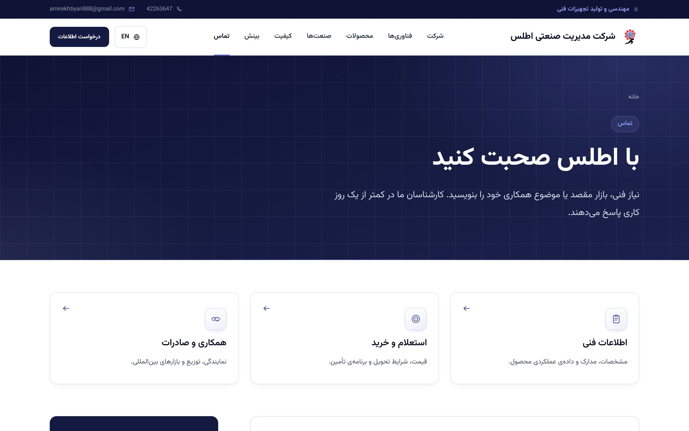</td>
  </tr>
  <tr>
    <td align="center"><sub>Engineering &amp; quality process</sub></td>
    <td align="center"><sub>Contact</sub></td>
  </tr>
</table>

### Mobile

<table>
  <tr>
    <td align="center">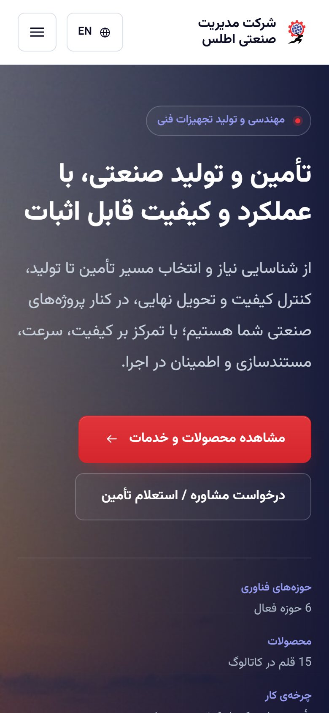</td>
    <td align="center">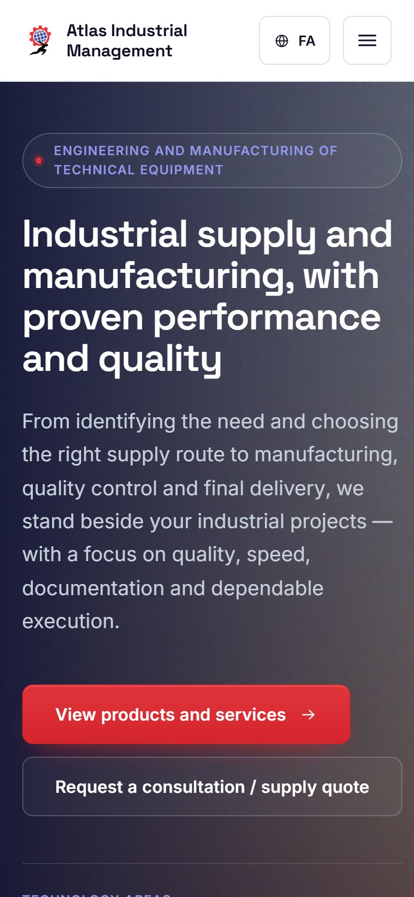</td>
    <td align="center">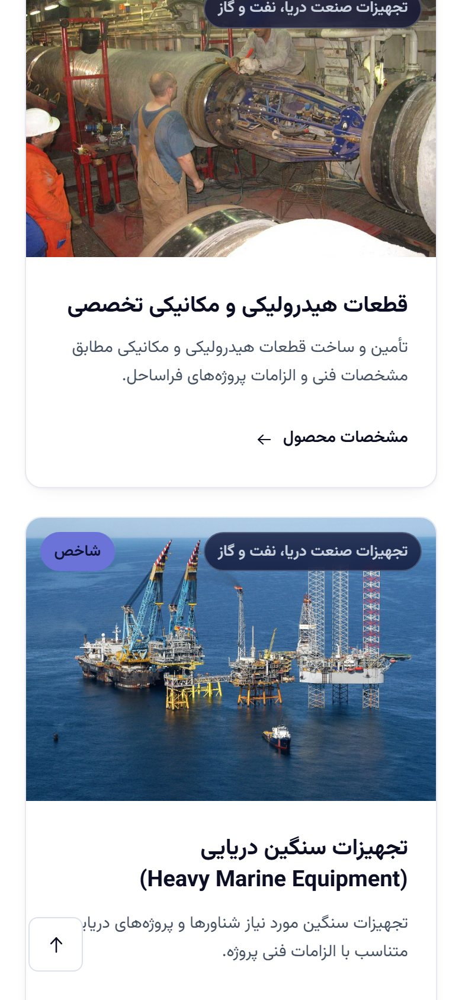</td>
  </tr>
  <tr>
    <td align="center"><sub>Home — Persian</sub></td>
    <td align="center"><sub>Home — English</sub></td>
    <td align="center"><sub>Products — Persian</sub></td>
  </tr>
</table>

---

## Tech stack

| Layer | Technology |
|---|---|
| Backend | Python 3.12+, Django 6.1 |
| Database | PostgreSQL |
| Translation | Django i18n (interface) + `django-modeltranslation` (content) |
| Frontend | Hand-written CSS design system and vanilla JavaScript — no build step |
| Media | Pillow (automatic resizing / compression), `qrcode` |

## Getting started

```bash
# 1. Create and activate a virtual environment
python -m venv .venv
.venv\Scripts\activate          # Windows
# source .venv/bin/activate     # macOS / Linux

# 2. Install dependencies
pip install -r requirements.txt

# 3. Configure environment variables
copy .env.example .env          # Windows  (cp on macOS / Linux)
#    then set SECRET_KEY, the DB_* settings and ALLOWED_HOSTS in .env

# 4. Create the database schema and an admin user
python manage.py migrate
python manage.py createsuperuser

# 5. Load the company's content, photos and catalogues (safe to re-run)
python manage.py load_client_content

# 6. Run the development server
python manage.py runserver
```

Open <http://127.0.0.1:8000/> for the site and <http://127.0.0.1:8000/admin/> for the admin panel.

> Secrets live only in `.env`, which is never committed — `.env.example` contains placeholders. Uploaded files (`media/`) are not tracked either; `load_client_content` rebuilds them from `content/client/`.

## Managing content

Everything visible on the site is edited from the admin panel, in Persian and English:

| What | Admin section |
|---|---|
| Company texts, logo, section images, contact details | اطلاعات شرکت |
| Products (photos, gallery, specs, documents) and product lines | محصولات / خطوط محصول |
| Services and their photos | خدمات |
| Client logos, letters of satisfaction, company gallery | مشتریان / رضایت‌نامه‌ها / گالری تصاویر شرکت |
| Certificates, statistics, values, FAQs, technologies, industries | استانداردها / آمار / تمایزها / پرسش‌های پرتکرار / … |

## Tests

```bash
python manage.py test
```

---

<div align="center">

**Designed & developed by [Amir Ekhtiyari](https://github.com/amir-ekhtiyari)**

Licensed under the [MIT License](LICENSE).

</div>
